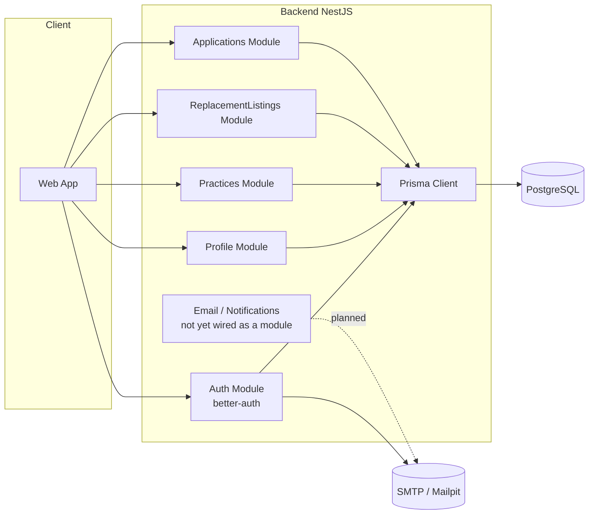
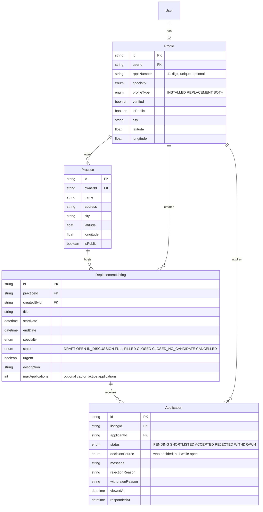
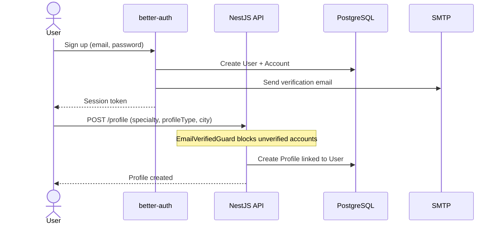
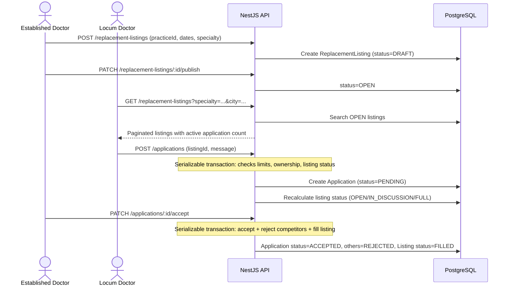
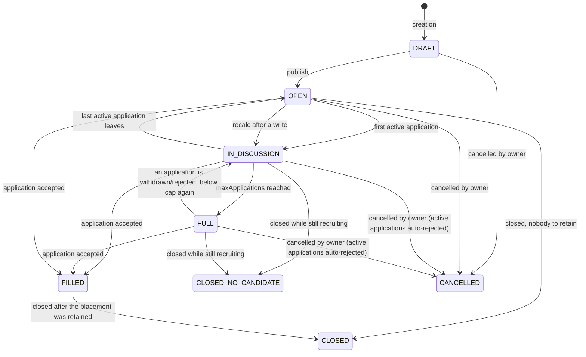
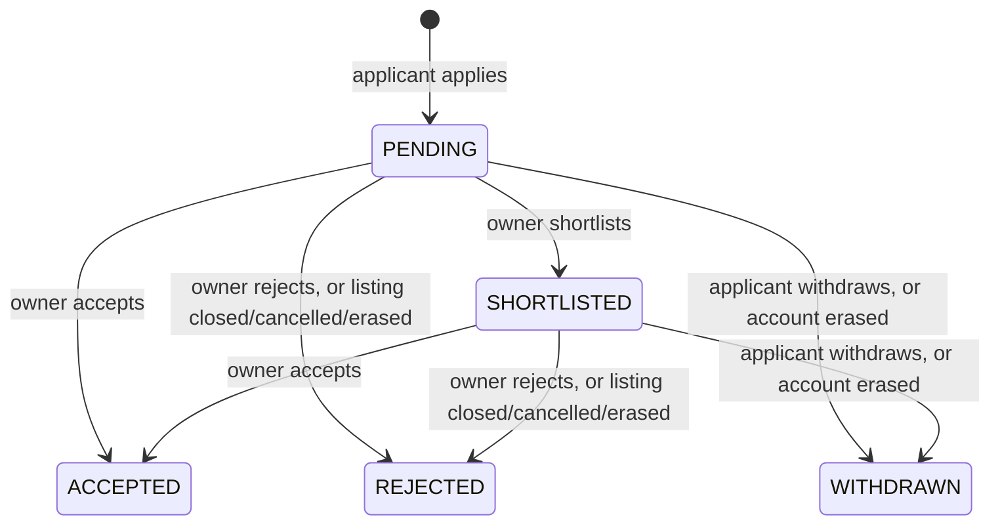
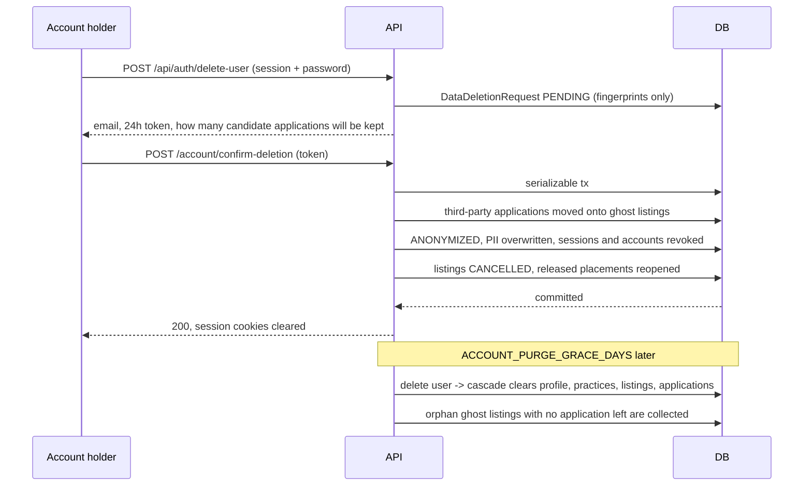

# Kineo

Application connecting established doctors with locum doctors (replacements) in France, with a differentiating positioning focusing on administrative automation (contracts, RPPS verification, statuses) rather than just simple job listings.

This document serves both as a product specification for a human and as context for an AI taking over the code (architecture, entities, flows, conventions). This specifically targets the **backend** of the fullstack project.

---

## 1. Context and Positioning

The market already includes established players:
- **MonRempla / Rempla** (regional network backed by CNOM) — leader, verification via the Medical Council.
- **RemplaMed, MesRemplas, Remplaclinic, RemplaJob** — private actors, classic matchmaking.

**Targeted differentiation**: reduce administrative friction rather than simply duplicating matchmaking.

| Axis | Description |
|---|---|
| Verification | RPPS / Medical Council status verified at registration (declarative in MVP, official API in V2) |
| Contract | Automatic generation of standard locum contract (pre-filled PDF) |
| Emergency | "Last-minute replacement" mode with alerts to nearby available locums |
| Reputation | Bilateral rating after replacement (Airbnb-style) |
| Niche | Initial targeting of a specific specialty or restricted geographical area, not a generalized national coverage |
| Communication | Applicants are never left in the dark: viewed/responded timestamps, shortlist status, and explicit rejection/withdrawal reasons |

**MVP scope** (minimal functional perimeter):
1. Registration / authentication (established doctor or locum)
2. Doctor profile (specialty, status, geographical area)
3. Publishing a replacement listing (practice, dates, specialty)
4. Search / apply for a listing
5. Application lifecycle with transparent status tracking (no messaging/conversation module yet)
6. Listing status (draft → open → in discussion → full → filled → closed/closed-without-candidate/cancelled)

Out of MVP scope: contract generation, payment, real-time RPPS API verification, rating, messaging/conversation module.

---

## 2. Tech Stack

- **Backend**: NestJS (TypeScript), running on Bun
- **ORM**: Prisma (`provider = postgresql`, driver adapter `@prisma/adapter-pg`)
- **Auth**: better-auth (email/password + sessions, optional JWT plugin, email verification)
- **Validation**: Zod via `nestjs-zod` (DTOs, response serialization, auto-generated OpenAPI schemas)
- **Email**: Nodemailer (SMTP), Mailpit for local dev
- **Database**: PostgreSQL
- **Security**: Helmet, `@nestjs/throttler` (multi-tier rate limiting), CORS, serializable transactions for concurrency-sensitive writes
- **Frontend**: TanStack Router + React (early scaffolding only, not covered by this document)

---

## 3. Global Architecture



---

## 4. Data Model

### 4.1 Auth (better-auth)

- `User`: base identity (email, name, `emailVerified`, image)
- `Session`, `Account`, `Verification`: managed by better-auth
- `Jwks`: only used if the optional JWT plugin is enabled (`JWT_ENABLED=true`)

### 4.2 Business Model (implemented)



### 4.3 System scaffold and ghost listings

`user.deletedAt` is set when an erasure runs, and a `DataDeletionRequest` row is written for the audit trail. Neither appears in the ERD above because neither is part of the candidate-facing model, but both are load-bearing.

**The scaffold** (`common/system-scaffold.ts`) is three fixed rows created by the `system_scaffold` migration: a `user`, its `profile` and its `practice`. It exists so an erasure has somewhere to move other people's applications to. Ids are constants rather than generated, because the erasure refers to them by id on every run.

**Ghost listings** are `CLOSED` listings owned by the scaffold practice, created one-per-original-listing during an erasure. They hold the applications other candidates had filed, so the `User → Profile → Practice → ReplacementListing → Application` cascade cannot destroy them. They are invisible to the public search (`findAll` only surfaces `OPEN`) and are collected by the daily sweep once no application points at them any more.

### 4.4 DataDeletionRequest (art. 5(2) accountability)

Deliberately has **no foreign key to `user`**: the row must survive the purge for the request/execution timeline to stay provable. It stores keyed fingerprints (`userIdHash`, `emailHash`) rather than identifiers — see §4.5 for how an operator queries one.

A partial **UNIQUE** index on `userIdHash WHERE status = 'PENDING'` is what makes a second concurrent request impossible. `sendDeleteAccountVerification` runs at READ COMMITTED, so without it two requests could both land and make the trail ambiguous.

### 4.5 Answering "was my request processed?"

There is no admin surface for this, and that is deliberate: the trail stores keyed fingerprints precisely so the database alone cannot answer it. Recomputing one needs `DELETION_PEPPER`, which never leaves the environment.

With both in hand, the fingerprint is an HMAC-SHA256 over the lowercased, trimmed identifier — the same `deletionHash` the application uses. So to answer a question about someone who has already been erased, compute the fingerprint from the email they used and look the trail up by it:

```sql
-- Given: the address the request was made from, and DELETION_PEPPER from the
-- environment of the instance that handled it.
SELECT status, "createdAt", "executedAt"
FROM data_deletion_request
WHERE "emailHash" = $fingerprint
ORDER BY "createdAt" DESC;
```

To recompute the fingerprint, compute it with `deletionHash(email, DELETION_PEPPER)` from `src/lib/hash.ts`. Two consequences worth knowing before you need this:

- **Losing the pepper does not lose the trail, it makes it unreachable.** The rows survive; the query that would match them cannot be built. A rotated pepper means every future confirmation also fails to find its pending request, so back the pepper up with the database and treat losing it as a production incident.
- **`emailHash` is written and never read by the application.** It exists for this procedure, and for nothing else.

**Not implemented**: `Conversation`/`Message` (messaging module), originally planned in the ERD, is out of scope for now — deferred until a real need emerges.

---

## 5. Main Flows

### 5.1 Registration and Profile Creation



> **Email links**: links sent by Better Auth emails (email verification, password
> reset) are rewritten to the Next.js frontend pages (`/verify-email`,
> `/reset-password`) using the `FRONTEND_URL` variable. The frontend pages then
> complete the flow through `authClient`, which proxies `/api/auth/*` to the
> NestJS API — the API remains the single authentication server and all
> endpoints are unchanged.
>
> The API also exposes a custom Better Auth endpoint, `GET
> /api/auth/check-email-verification?token=…`: given a verification token (even
> an expired or already-used one) it reports whether the account is already
> verified. The `/verify-email` page uses it to show the success screen when a
> user re-clicks an old email link, and the signup page displays a “check your
> inbox” confirmation with a resend action after registration.

### 5.2 Listing Publication and Application



### 5.3 Listing Lifecycle



`CLOSED_NO_CANDIDATE` is what makes "they found someone" and "nobody was taken" tellable apart to a shortlisted candidate. It exists because `close` became reachable from a listing that was still recruiting, where the plain `CLOSED` reason would have read as a successful placement.

`FILLED` is the one terminal status `close` accepts and `cancel` refuses: the placement is already written, and cancelling would leave the accepted candidate holding a post that no longer exists. Every terminal-status decision reads `TERMINAL_LISTING_STATUSES` from `common/listing-status.ts` — the guards used to redraw that list each, which is how they came to disagree.

### 5.4 Application Lifecycle



`decisionSource` records **who** settled the row, and is `null` while the application is still open. `status` alone could not carry this: "rejected" reads the same whether a practice refused the candidate, closed the posting, cancelled it, or the posting's owner erased their account — four situations the applicant needs to tell apart.

The values are `CANDIDATE_WITHDREW`, `PRACTICE_ACCEPTED`, `PRACTICE_REJECTED`, `ANOTHER_CANDIDATE_SELECTED`, `LISTING_CLOSED`, `LISTING_CLOSED_NO_CANDIDATE`, `LISTING_CANCELLED`, `LISTING_ERASED`, `CANDIDATE_UNAVAILABLE`.

A candidate who is erased while holding an `ACCEPTED` placement is a special case: the listing is reopened and the auto-rejected pool is put back in the pipeline, because the premise under which they were turned down no longer holds.

`rejectionReason` is stored verbatim, in French, and reaches the applicant as written — see `applications/rejection-reasons.ts` for the platform-authored strings and the historical spellings that must keep matching.

### 5.5 Account Erasure (art. 17 GDPR)

Erasure is deliberately **not** a single hard delete. The account is anonymized as soon as the link is confirmed, and the physical purge happens later, so an art. 17(3) hold can still be applied in between.

better-auth is used for the **request** phase only. Its `deleteUser` handler also reaches `internalAdapter.deleteUser` — a raw cascade through every application on the account — from two routes that never consult the request hook: `POST /delete-user` with a `token` body field, and `GET /delete-user/callback?token=`. Both need nothing but the caller's own session. `deleteUser.beforeDelete` refuses both, and there is an e2e suite whose only subject is that refusal; `POST /account/confirm-deletion` is the only route that can erase.



**No blocker.** An earlier version refused the erasure with a `409` while another candidate held an application on one of the account's listings, on the grounds that the cascade would destroy that candidate's data. That was wrong twice over: the third party's message and the practice's decision are not ours to erase on someone else's request, and refusing left the account holder permanently unable to exercise a right the law gives them.

The applications are now **moved onto ghost listings** before the anonymization, inside the same transaction, so the cascade stops short of them and the erasure goes through. Each is settled as `REJECTED` with `decisionSource: LISTING_ERASED`, and the candidate is told the posting no longer exists — without disclosing anything about the erasure. The three endpoints that delete a listing, a practice or a profile outright keep their own guard, because they have no equivalent step.

**What is erased at confirmation**: `user.name`/`image`/`email` (replaced by a deterministic `deleted+<hash>@deleted.invalid`), `profile.rppsNumber`/`city`/coordinates, practice name and address, listing titles and descriptions, the rejection reasons the account holder wrote, and the application messages and withdrawal reasons it wrote on other people's listings. Its own applications leave the `PENDING`/`SHORTLISTED` pipeline, so nobody keeps a candidate they can no longer reach.

**What is retained**: two keyed fingerprints (HMAC-SHA256 over `DELETION_PEPPER`) plus timestamps, for `DATA_DELETION_REQUEST_RETENTION_DAYS`. A request that was never confirmed is dropped after `PENDING_DELETION_REQUEST_RETENTION_DAYS`, since it only ever recorded an intention. Answering "was my request processed?" needs `DELETION_PEPPER` and a recomputed fingerprint — see §4.5.

**Session revocation**: the `Session` rows are deleted inside the transaction *and* the browser's cookies are cleared by the controller. Deleting the rows alone is invisible to the client — `session_token` is a signed cookie that keeps verifying, and better-auth only consults the database on a cache miss.

**Known limits**: there is no user-facing undo during the grace period (the email address is not recoverable without encrypting the original). Data portability (art. 15/20) and the consent register (art. 7) are not implemented. The session cookie cache must stay off (`COOKIE_CACHE_ENABLED=false`): better-auth cannot invalidate it server-side, so it would keep serving `emailVerified: true` for an account the database has already anonymized.

---

## 6. Security & Reliability

Most of the following came out of a series of security-audit remediation commits on the `fix/security-audit-remediation` branch; the audit document itself is not in the repository.

- **Access control**: ownership checks on every mutating route across all four modules; `404` (not `403`) returned for private resources to avoid enumeration.
- **Verified email on writes**: `EmailVerifiedGuard` is applied at **controller** level on all four business controllers, and reads the HTTP method — `POST`/`PUT`/`PATCH`/`DELETE` are gated, reads are not. It reads the flag from the database row rather than the session payload, because the erasure is exactly the case where that snapshot lies: the row says `emailVerified = false` while the cookie still says `true`. `deletedAt` is checked alongside it, before `REQUIRE_EMAIL_VERIFICATION` — an erased account is refused either way. The requirement itself is read from that flag rather than assumed: it used to be unconditional, which contradicted the shipped default, since better-auth only sends a verification email on sign-up when the flag is on. Every write then answered `403` and no email had ever been sent to satisfy it.
- **Hardening closed by default**: `NODE_ENV` defaults to `production` and `TRUST_PROXY` defaults to on outside development. Both used to default the other way, and `configuration()` substituting a value meant the missing-value branch of `isHardenedEnv` was unreachable from the running application: an operator who never set `NODE_ENV` — which is what the `Dockerfile` does — got Swagger, the auth reference, non-`Secure` cookies and unsanitised error bodies.
- **Concurrency**: `Serializable` isolation level with automatic retry (`common/serializable-transaction.ts`) on every write that touches shared counters (application limits, listing capacity, accept/reject cascades).
- **Rate limiting**: multi-tier throttling (`short`/`medium`/`long`/`deletion`) via `@nestjs/throttler`, with a dedicated `deletion` tier (5 attempts / 15 min) scoped to the anonymous account-erasure endpoint. Both the `ttl` and the `limit` of every tier are configurable (`THROTTLE_*_TTL` / `THROTTLE_*_LIMIT`), and limits are read from the validated `ConfigService` — never re-read at import time, which used to give the decorators a second, unvalidated copy of the numbers. A `ttl` above `2^31-1` ms is rejected at boot: Node clamps the `setTimeout` to 1 ms and the tier would silently stop limiting.
- **Throttling key on the erasure token, not only the IP** (`TokenAwareThrottlerGuard`). The endpoint is anonymous and the token is the only proof of identity, so keying on the IP alone meant that behind a proxy with `trust proxy` off — the shipped default, and the wrong one for a separate frontend origin — six requests from one host locked *every* user's right to erasure under art. 17 for the length of the window. Adding the token separates the budgets; brute force stays bounded because an attacker gets five attempts against any one token, and the token carries about 165 bits of entropy.
- **better-auth's credential limiter is overridable.** It hardcodes 3 sign-ins per 10 seconds for `/sign-in*`, `/sign-up*`, `/change-password` and `/change-email`, and its own `window`/`max` do not reach it — so that bucket is now `CREDENTIAL_RATE_LIMIT_WINDOW` / `CREDENTIAL_RATE_LIMIT_MAX`. It also locked out everyone sharing an egress IP.
- **Input validation**: length/range constraints on every Zod DTO (text fields capped, coordinates bounded, RPPS format-checked, query objects `.strict()`); per-profile resource caps configurable via env vars (`MAX_PRACTICES_PER_PROFILE`, `MAX_ACTIVE_LISTINGS_PER_PROFILE`, `MAX_ACTIVE_APPLICATIONS_PER_PROFILE`).
- **Transport security**: Helmet with a CSP scoped to allow the Scalar-based Swagger UI; CORS restricted to `TRUSTED_ORIGINS`; production error bodies sanitized by `HttpExceptionFilter`.
- **Email**: HTML-escaped templates, no plaintext token logging, real SMTP delivery (auth + TLS aware) with error handling that never blocks the underlying business transaction.
- **Indexes**: composite and partial indexes aligned with actual query patterns (`status`-filtered lookups on listings/applications, bounding-box geo search on practices, hash index on `verification.identifier`). `session.expiresAt` and `verification.expiresAt` are indexed because the hourly sweep filters on them alone, and `verification` also carries a btree on `(identifier, expiresAt)`: the hash index cannot serve the erasure's `LIKE 'delete-account-%'` prefix range, which ran as a scan inside a `Serializable` transaction with a 10 s timeout.
- **Scheduled work**: both retention sweeps take a Postgres advisory lock, so N replicas do not each run a full scan and delete of the same rows on the same hour; they delete in batches rather than one transaction sized by the whole backlog; and a failure in the account cascade no longer skips the ghost-listing collection, which used to leave orphans accumulating silently for a day.
- **The system scaffold is recreated at boot.** The ghost listings reference the system practice and profile by id, and those rows exist because one `ON CONFLICT DO NOTHING` migration inserted them — so a restore that excluded them, or a `db:push` deployment, left every erasure touching a third-party application dying on an unnamed foreign-key violation.

**Tests**: 324 unit tests across 26 files, plus 43 end-to-end tests that build the application through `createApp()` — the same factory `main.ts` uses, so helmet, compression, CORS, `trust proxy` and the Swagger gate are exercised too — against a throwaway PostgreSQL database, and drive it over HTTP. CI runs both, then the seed and the migration drift check.

The e2e suites each own their own database and must run in separate processes, because `lib/prisma.ts` binds its adapter to `DATABASE_URL` at import time. `bun run test` passes `--path-ignore-patterns '**/e2e/**'` to keep them apart, so `bun run test` and `bun run test:e2e` are the two entry points.

**What CI checks**: `prisma validate`, `bun run build` (the shipped tsconfig), `bun run typecheck:tests` (the seed, which the build config cannot reach), `bun run lint`, `bun run test`, `bun run test:e2e`, `bun run db:seed`, `bun run db:check`. The last one replays the whole migration history into an empty database and diffs it against `schema.prisma` — it is what catches a migration renamed after it shipped.

Still not done: email notifications on status changes are written (templates + mailer) but not yet wired into `ApplicationsService` — planned as a dedicated `NotificationsModule`. The specs are not type-checked (see §8). And the two search paths still disagree about `_`: the geographic one hand-writes `ILIKE` and escapes it, while the plain one hands the term to Prisma's `contains`, which escapes `%` but treats `_` as a single-character wildcard. Prisma exposes no `ESCAPE`, and moving those endpoints onto raw SQL to escape one character would add injection surface for tidier search results, so it is pinned by a test instead.

---

## 7. Roadmap

- [x] Auth (better-auth + Prisma, optional JWT, email verification, password reset)
- [x] Profile Module (CRUD, public/private visibility, pagination, RPPS format validation)
- [x] Practice Module (CRUD, geo search with bounding-box pre-filter)
- [x] ReplacementListing Module (full lifecycle, capacity threshold, geo/date/specialty search)
- [x] Application Module (apply, shortlist, accept/reject cascade, withdraw, view tracking)
- [x] Security hardening (throttling, Helmet, CORS, indexes, input validation, concurrency safety)
- [x] GDPR account erasure (art. 17): anonymization, deferred purge, ghost-listing detachment, audit trail
- [x] Automated test suite (324 unit tests + 43 e2e over HTTP against a real database, wired into CI, along with the seed and the migration drift check)
- [ ] Email notifications wired into the application lifecycle (`NotificationsModule`)
- [ ] Messaging Module (conversation linked to an application) — deferred, not MVP-critical
- [ ] Frontend (early TanStack Router scaffolding only)
- [ ] V2: RPPS verification via official API, PDF contract generation, bilateral rating, geolocated "emergency" alerts
- [ ] Decouple Auth from better-auth (deferred tech debt, not MVP): introduce an `AuthPort` (`IAuthProvider`) behind a NestJS wrapper so better-auth becomes swappable — isolate `Session`/`UserSession`/`AllowAnonymous` (`@thallesp/nestjs-better-auth`) in controllers, `lib/auth.ts` (`betterAuth`, `prismaAdapter`, plugins), guards (`email-verified.guard.ts`), and `hashPassword` usage in `prisma/seed.ts`
- [ ] Email via `NotificationsModule` with an `EmailPort` (deferred, not MVP): Nodemailer is already isolated in `lib/email/mailer.ts` (low coupling, single import point) — the work is functional decoupling (queue/retry, wiring into `ApplicationsService`, provider-agnostic templates in `lib/email/templates/*`), not swapping Nodemailer itself

---

## 8. Notes for AI Takeover

- The `User`, `Session`, `Account`, `Verification`, `Jwks` models are managed by better-auth: do not modify them manually, regenerate via the better-auth CLI if additional fields are needed on `User`.
- All business data (specialty, status, location) lives in `Profile`, not in `User`.
- `email-verified.guard.ts` must be applied on **controllers**, not services — Nest guards have no effect on plain service methods. Apply it at **controller class** level, not per handler: it gates by HTTP method, and enumerating the protected handlers by hand is what let `PATCH`/`DELETE` through unchecked in the first place.
- Every service that needs to check resource ownership uses the shared helpers in `common/profile-lookup.ts` rather than duplicating `findUnique` logic.
- Any write that reads-then-writes a shared counter (application count, listing capacity) must go through `runSerializableTransaction` (`common/serializable-transaction.ts`) to avoid race conditions.
- Zod entity schemas use `z.iso.datetime()` for date fields exposed to Swagger — plain `z.date()` breaks OpenAPI generation (`nestjs-zod` / Zod v4 limitation) and must not be reintroduced.
- No payment or legal contract logic is implemented yet: to be handled in V2 with particular vigilance on compliance (GDPR, health data indirectly linked via RPPS).
- `data_deletion_request` stores **keyed fingerprints, never plain identifiers**. Anything reading that table must go through `deletionHash(value, pepper)` (`lib/hash.ts`); computing a raw hash of an email to search it would defeat the purpose and, since an email has low entropy, would be reversible by dictionary.
- `DELETION_PEPPER` is a separate secret on purpose. Do not reuse `BETTER_AUTH_SECRET`, and back it up with the database: rotating it does not lose the trail but does make it unsearchable.
- A deletion token is a bearer secret carried in a URL. Never log it, and keep the `deletion` throttle tier on any route that accepts one.
- **Do not hand-write a list of `ListingStatus` values.** Read `TERMINAL_LISTING_STATUSES` from `common/listing-status.ts`. Four guards each redrew the list once, and they drifted: `update` and `accept` were missing `CLOSED_NO_CANDIDATE` for a whole release. `src/common/listing-status-guards.spec.ts` is a table over all four guards × every enum member, and it iterates `Object.values(ListingStatus)` at runtime — **adding a member to the enum fails the test suite until every guard's row is written.** That is the mechanism, and it only works if the table is updated rather than bypassed. Note it is a test, not a build step: the declared type is `Record<string, Record<ListingStatus, Decision>>`, so the outer key is not exhaustiveness-checked at compile time. The runtime iteration is what does the work.
- **The listing status is derived state.** Any write that moves an application in or out of the active set must go through `recalcListingStatus` (`common/listing-status.ts`). It was reimplemented inline in `ApplicationsService.create` once; two copies of the rule is how they diverge.
- **Every paginated query needs a total order**: `orderBy: [{ createdAt: "desc" }, { id: "desc" }]`. Without the `id` tie-breaker the database may return a different slice on each call, so page 2 repeats rows from page 1. This was fixed on one endpoint out of six.
- **Never read `process.env` at module scope** in anything a decorator or a provider can load early. `throttle-with-config.decorator.ts` used to call `configuration()` at import, freezing a second unvalidated copy of the throttle limits and throwing at load rather than at boot.
- **A 404 in a guard test is a broken test, not a refusal.** Rethrow it: it means the fixture never reached the guard, and counting it as a "refused" passes for the wrong reason.
- **The e2e suites refuse to share a process** (`KINEO_E2E_SUITE` guard in `e2e/harness.ts`), because `lib/prisma.ts` binds its adapter to `DATABASE_URL` at import time. Run them with `bun run test:e2e`. `bun test src` on its own would load them all into one process and fail on the database names colliding.
- **The e2e suites need `TEST_DATABASE_ADMIN_URL`** (defaults to the `docker-compose.yml` credentials) and create a database per suite. With any other `DATABASE_URL`, point it at a maintenance database whose credentials can `CREATE DATABASE`. `TEST_DATABASE_NAME` overrides the generated name when you want to inspect what a run left behind.
- **The specs are not type-checked.** `tsconfig.test.json` covers `prisma/seed.ts`, which the build config cannot reach, but the specs are excluded: their Prisma fakes are deliberately loose, and typing them properly is its own change. `bun test` executes them without checking them, so a type error in a spec merges green. Adding that check is the obvious next cleanup — the loose fakes hide real bugs, and it already found one.