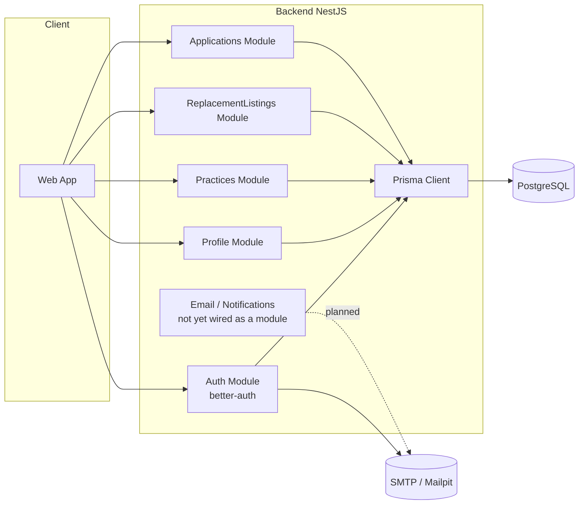
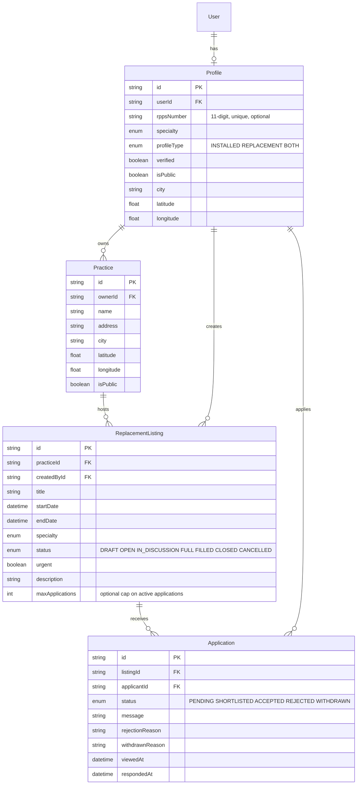
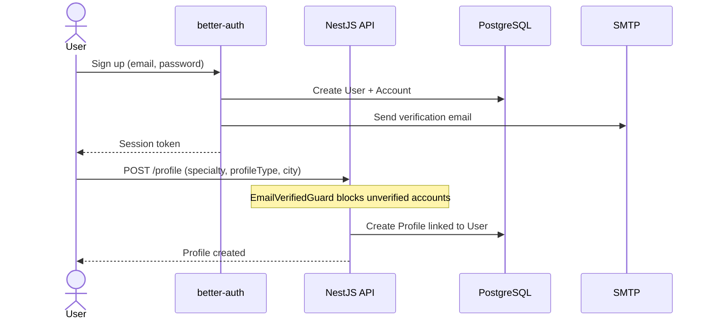
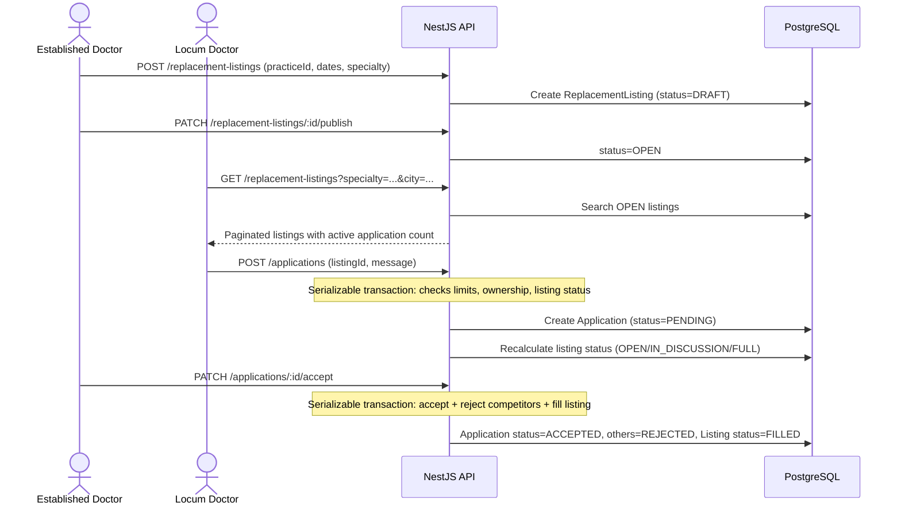
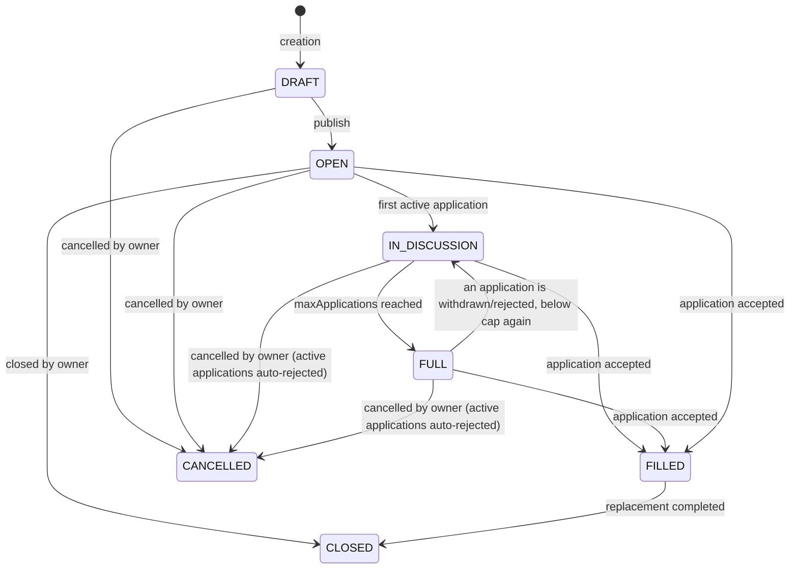
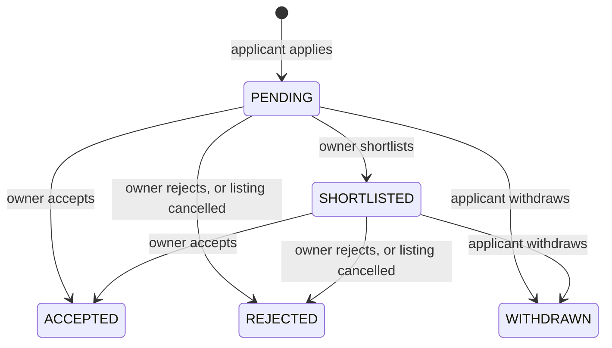

# Kineo

Application connecting established doctors with locum doctors (replacements) in France, with a differentiating positioning focusing on administrative automation (contracts, RPPS verification, statuses) rather than just simple job listings.

This document serves both as a product specification for a human and as context for an AI taking over the code (architecture, entities, flows, conventions). This specifically targets the **backend** of the fullstack project.

---

## 1. Context and Positioning

The market already includes established players:
- **MonRempla / Rempla** (regional network backed by CNOM) — leader, verification via the Medical Council.
- **RemplaMed, MesRemplas, Remplaclinic, RemplaJob** — private actors, classic matchmaking.

**Targeted differentiation**: reduce administrative friction rather than simply duplicating matchmaking.

| Axis | Description |
|---|---|
| Verification | RPPS / Medical Council status verified at registration (declarative in MVP, official API in V2) |
| Contract | Automatic generation of standard locum contract (pre-filled PDF) |
| Emergency | "Last-minute replacement" mode with alerts to nearby available locums |
| Reputation | Bilateral rating after replacement (Airbnb-style) |
| Niche | Initial targeting of a specific specialty or restricted geographical area, not a generalized national coverage |
| Communication | Applicants are never left in the dark: viewed/responded timestamps, shortlist status, and explicit rejection/withdrawal reasons |

**MVP scope** (minimal functional perimeter):
1. Registration / authentication (established doctor or locum)
2. Doctor profile (specialty, status, geographical area)
3. Publishing a replacement listing (practice, dates, specialty)
4. Search / apply for a listing
5. Application lifecycle with transparent status tracking (no messaging/conversation module yet)
6. Listing status (draft → open → in discussion → full → filled → closed/cancelled)

Out of MVP scope: contract generation, payment, real-time RPPS API verification, rating, messaging/conversation module.

---

## 2. Tech Stack

- **Backend**: NestJS (TypeScript), running on Bun
- **ORM**: Prisma (`provider = postgresql`, driver adapter `@prisma/adapter-pg`)
- **Auth**: better-auth (email/password + sessions, optional JWT plugin, email verification)
- **Validation**: Zod via `nestjs-zod` (DTOs, response serialization, auto-generated OpenAPI schemas)
- **Email**: Nodemailer (SMTP), Mailpit for local dev
- **Database**: PostgreSQL
- **Security**: Helmet, `@nestjs/throttler` (multi-tier rate limiting), CORS, serializable transactions for concurrency-sensitive writes
- **Frontend**: TanStack Router + React (early scaffolding only, not covered by this document)

---

## 3. Global Architecture



---

## 4. Data Model

### 4.1 Auth (better-auth)

- `User`: base identity (email, name, `emailVerified`, image)
- `Session`, `Account`, `Verification`: managed by better-auth
- `Jwks`: only used if the optional JWT plugin is enabled (`JWT_ENABLED=true`)

### 4.2 Business Model (implemented)



**Not implemented**: `Conversation`/`Message` (messaging module), originally planned in the ERD, is out of scope for now — deferred until a real need emerges.

---

## 5. Main Flows

### 5.1 Registration and Profile Creation



> **Email links**: links sent by Better Auth emails (email verification, password
> reset) are rewritten to the Next.js frontend pages (`/verify-email`,
> `/reset-password`) using the `FRONTEND_URL` variable. The frontend pages then
> complete the flow through `authClient`, which proxies `/api/auth/*` to the
> NestJS API — the API remains the single authentication server and all
> endpoints are unchanged.
>
> The API also exposes a custom Better Auth endpoint, `GET
> /api/auth/check-email-verification?token=…`: given a verification token (even
> an expired or already-used one) it reports whether the account is already
> verified. The `/verify-email` page uses it to show the success screen when a
> user re-clicks an old email link, and the signup page displays a “check your
> inbox” confirmation with a resend action after registration.

### 5.2 Listing Publication and Application



### 5.3 Listing Lifecycle



### 5.4 Application Lifecycle



---

## 6. Security & Reliability

Resolved in the branches that built this section; the state of each is
reflected below rather than claimed:

- **Access control**: ownership checks on every mutating route across all four modules; `404` (not `403`) returned for private resources to avoid enumeration.
- **Concurrency**: `Serializable` isolation level with automatic retry (`common/serializable-transaction.ts`) on every write that touches shared counters (application limits, listing capacity, accept/reject cascades).
- **Rate limiting**: multi-tier throttling (`short`/`medium`/`long`) via `@nestjs/throttler`, declared once in `config/configuration.ts` and applied per route by `common/throttle.ts`; proxy-aware IP tracking. A fourth `deletion` tier is registered but refused by the guard unless the route opted in, so its budget cannot leak onto the rest of the API. better-auth's own 3-per-10s rule on the credential endpoints is overridden by `CREDENTIAL_RATE_LIMIT_*`.
- **Account erasure**: `deleteUser.beforeDelete` refuses better-auth's hard delete, so the only path is the anonymization described in §9. The `verification` purge, the ghost listings and the keyed trail are covered by the e2e suite, not only by fakes.
- **Input validation**: length/range constraints on every Zod DTO (text fields capped, coordinates bounded, RPPS format-checked); per-profile resource caps configurable via env vars (`MAX_PRACTICES_PER_PROFILE`, `MAX_ACTIVE_LISTINGS_PER_PROFILE`, `MAX_ACTIVE_APPLICATIONS_PER_PROFILE`).
- **Transport security**: Helmet with a CSP scoped to allow the Scalar-based Swagger UI; CORS restricted to `TRUSTED_ORIGINS`.
- **Email**: no more plaintext token logging; real SMTP delivery (auth + TLS aware) with error handling that never blocks the underlying business transaction. Every HTML template escapes its interpolations and refuses a call to action whose target is not http(s).
- **Indexes**: composite and partial indexes aligned with actual query patterns (`status`-filtered lookups on listings/applications, bounding-box geo search on practices).

Automated tests are wired into CI and are not optional any more: 201 unit tests over `bun test`, and two e2e suites (`bun run test:e2e`) that boot the real `AppModule` through `createApp()`, replay the migration history into a throwaway database and drive it over HTTP. Every pull request runs `prisma validate`, `generate`, `build`, `typecheck` (which covers the specs and the seed, unlike the build), `lint`, the unit suites, the e2e suites, the seed, and a migration drift gate that replays the history and diffs it against `schema.prisma`.

Still open: email notifications on status changes are written (templates + mailer) but not wired into `ApplicationsService` — planned as a dedicated `NotificationsModule`.

---

## 7. Roadmap

- [x] Auth (better-auth + Prisma, optional JWT, email verification, password reset)
- [x] Profile Module (CRUD, public/private visibility, pagination, RPPS format validation)
- [x] Practice Module (CRUD, geo search with bounding-box pre-filter)
- [x] ReplacementListing Module (full lifecycle, capacity threshold, geo/date/specialty search)
- [x] Application Module (apply, shortlist, accept/reject cascade, withdraw, view tracking)
- [x] Security hardening (throttling, Helmet, CORS, indexes, input validation, concurrency safety)
- [x] Account erasure (art. 17): anonymization instead of deletion, keyed audit trail, third-party applications parked on ghost listings, purge after the grace period
- [x] Automated test suite (unit + e2e), enforced in CI
- [ ] Email notifications wired into the application lifecycle (`NotificationsModule`)
- [ ] Messaging Module (conversation linked to an application) — deferred, not MVP-critical
- [ ] Frontend (early TanStack Router scaffolding only)
- [ ] V2: RPPS verification via official API, PDF contract generation, bilateral rating, geolocated "emergency" alerts
- [ ] Decouple Auth from better-auth (deferred tech debt, not MVP): introduce an `AuthPort` (`IAuthProvider`) behind a NestJS wrapper so better-auth becomes swappable — isolate `Session`/`UserSession`/`AllowAnonymous` (`@thallesp/nestjs-better-auth`) in controllers, `lib/auth/index.ts` (`betterAuth`, `prismaAdapter`, plugins), guards (`email-verified.guard.ts`), and `hashPassword` usage in `prisma/seed.ts`
- [ ] Email via `NotificationsModule` with an `EmailPort` (deferred, not MVP): Nodemailer is already isolated in `lib/email/mailer.ts` (low coupling, single import point) — the work is functional decoupling (queue/retry, wiring into `ApplicationsService`, provider-agnostic templates in `lib/email/templates/*`), not swapping Nodemailer itself

---

---

## 8. Running it

Requires a PostgreSQL reachable at `DATABASE_URL` and a `bun install`.

| Command | What it does |
| --- | --- |
| `bun run dev` | `nest start --watch` |
| `bun run build` | `nest build` (excludes the specs and the e2e suites) |
| `bun run typecheck` | `tsc` over `src/` **and** `prisma/`, specs and e2e included |
| `bun run lint` | Biome, formatting + correctness rules |
| `bun run test` | Unit suites, excluding `**/e2e/**` |
| `bun run test:e2e` | Both e2e suites, each on its own throwaway database |
| `bun run db:migrate` | Create and apply a migration from a `schema.prisma` change |
| `bun run db:seed` | **Wipe and repopulate.** Creates the system scaffold (§9) |
| `bun run db:check` | Replay the migration history and diff it against the schema |

`bun run db:seed` **is a deploy step**, not a convenience: the account erasure
parks other candidates' applications on rows the seed creates, and a deployment
that skipped it would refuse every erasure with a message saying so.

## 9. The account erasure

The endpoint is `POST /account/confirm-deletion` with the token from the emailed
link. No session is required: better-auth's own `delete-user` demands a valid
cookie at click time, which answers "invalid link" from a different browser or a
blocked cookie. The emailed token is the proof of identity.

What it does, in order:

1. Consumes the single-use `delete-account-*` token, refusing an expired one.
2. Moves the applications other candidates wrote on this account's listings onto
   a ghost listing owned by the system scaffold. They are not the account
   holder's data to erase, so both their authors and the practices that received
   them keep a real row.
3. Anonymizes: the address becomes `erased-<fingerprint>@deleted.invalid`, the
   name and image go, the profile loses its RPPS number, city and coordinates, the
   listings lose their title, description and dates and leave circulation, the
   account's own applications are settled so their listings recalculate.
4. Drops the sessions and credentials, so the erasure takes effect immediately.
5. Sets `deletedAt`. The hourly sweep drops the row after
   `ACCOUNT_PURGE_GRACE_DAYS`.

A listing holding an **accepted placement** is deliberately left alone: the
placement was agreed with a candidate who is still waiting for an answer. It
leaves circulation rather than being scrubbed, and the response says how many
there are.

The trail (`DataDeletionRequest`) stores two keyed fingerprints, not the
identifier:

```
userIdHash = HMAC-SHA256(DELETION_PEPPER, userId)
emailHash  = HMAC-SHA256(DELETION_PEPPER, email)
```

An unkeyed hash would not do: the inputs are emails and cuid ids, enumerable from
any other table of the same dump.

**Back up `DELETION_PEPPER` with the database.** Losing it does not erase the
trail, it makes the trail unreachable: nothing can compute the fingerprint to
search for. The trail holds no identifier either way.

To answer "was this person processed?", compute the fingerprint and query:

```sql
SELECT "status", "createdAt", "executedAt"
FROM "data_deletion_request"
WHERE "emailHash" = '<HMAC-SHA256 of the address under the pepper>';
```

`emailHash` is written and never read by the application; it exists so an
operator can do this without a dump.

### 9.1 If the trail migration stops halfway

The two migrations around the trail are split on purpose. The first adds nullable
fingerprint columns; the second makes them `NOT NULL` and drops the plaintext
`userId`/`email`. A database still holding trail rows fails the second rather than
losing them — an accountability record is not ours to rewrite.

If `bun run db:migrate` reports a failure in `enforce_erasure_fingerprints`:

```bash
DELETION_PEPPER=<the real pepper> bun run db:seed   # recomputes the fingerprints
bun run db:migrate                                  # now succeeds
```

`db:seed` also wipes the rest of the data, so on anything but a development
database, run the backfill by hand instead:

```sql
-- one row at a time, with the fingerprints computed by your own script
UPDATE "data_deletion_request"
SET "userIdHash" = '<hmac>', "emailHash" = '<hmac>', "updatedAt" = NOW()
WHERE "userIdHash" IS NULL;
```

## 10. Notes for the next reader

- Nothing checks a migration that was hand-edited or renamed: `bun run db:check`
  is the gate, and it is in CI. Do not give a migration folder a hand-picked
  timestamp — a name dated in the future sorts before everything generated after
  it, and the replay fails.
- The e2e suites need `bun run test:e2e`. Running `bun test src` collects them
  too, and they refuse to share a process with anything else: the whole
  application reads `DATABASE_URL` at import time, so a suite that loaded after a
  unit spec would silently assert against the developer's own database.
- Every list endpoint orders by `createdAt` then `id`. `createdAt` is not unique,
  and offset pagination over a non-total order repeats and skips rows.

## 11. Notes for AI Takeover

- The `User`, `Session`, `Account`, `Verification`, `Jwks` models are managed by better-auth: do not modify them manually, regenerate via the better-auth CLI if additional fields are needed on `User`.
- All business data (specialty, status, location) lives in `Profile`, not in `User`.
- `email-verified.guard.ts` must be applied on **controllers**, not services — Nest guards have no effect on plain service methods.
- Every service that needs to check resource ownership uses the shared helpers in `common/profile-lookup.ts` rather than duplicating `findUnique` logic.
- Any write that reads-then-writes a shared counter (application count, listing capacity) must go through `runSerializableTransaction` (`common/serializable-transaction.ts`) to avoid race conditions.
- Zod entity schemas use `z.iso.datetime()` for date fields exposed to Swagger — plain `z.date()` breaks OpenAPI generation (`nestjs-zod` / Zod v4 limitation) and must not be reintroduced.
- No payment or legal contract logic is implemented yet: to be handled in V2 with particular vigilance on compliance (GDPR, health data indirectly linked via RPPS).